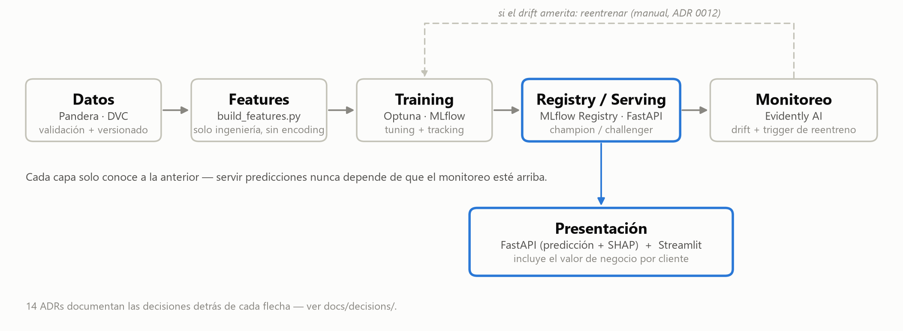
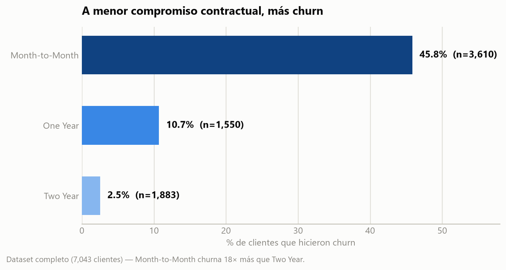
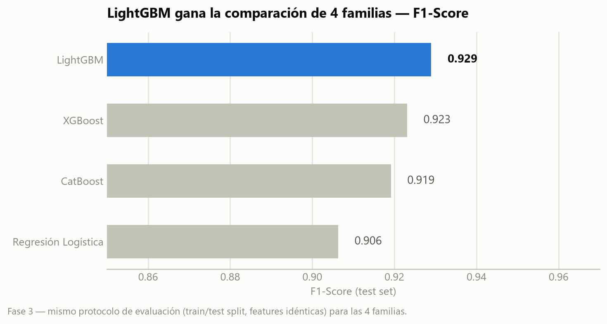
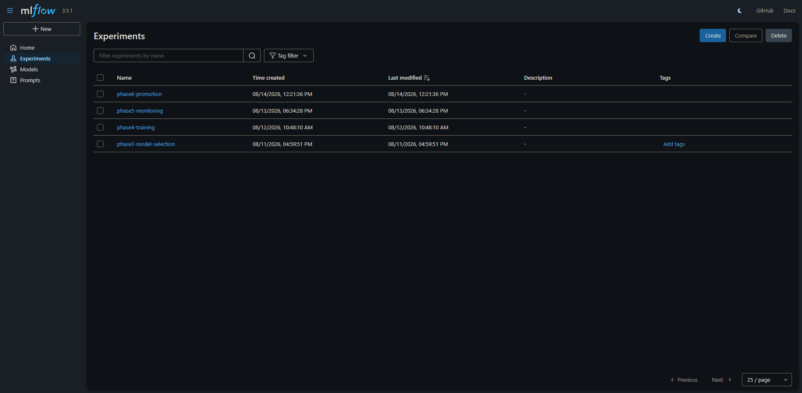
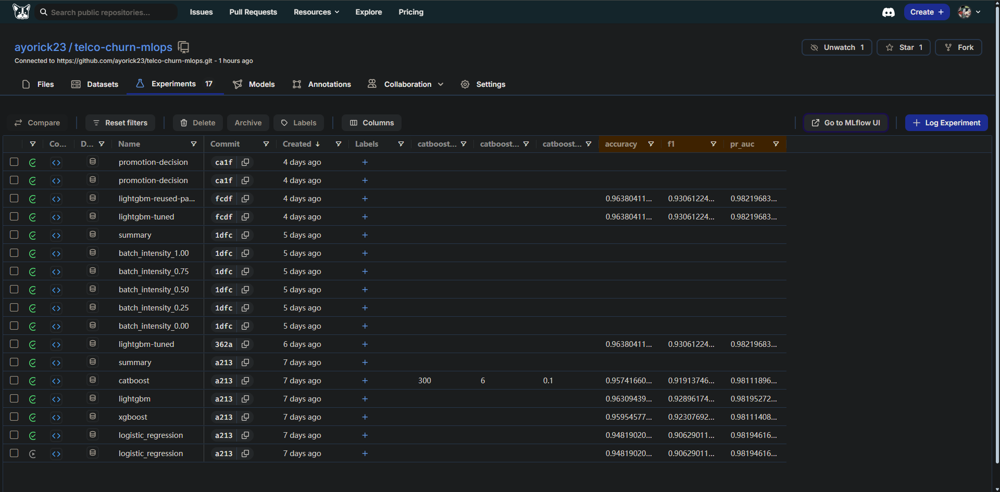
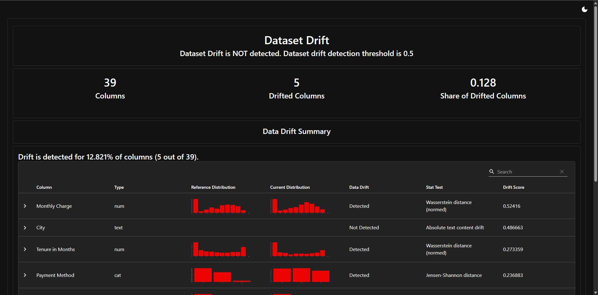
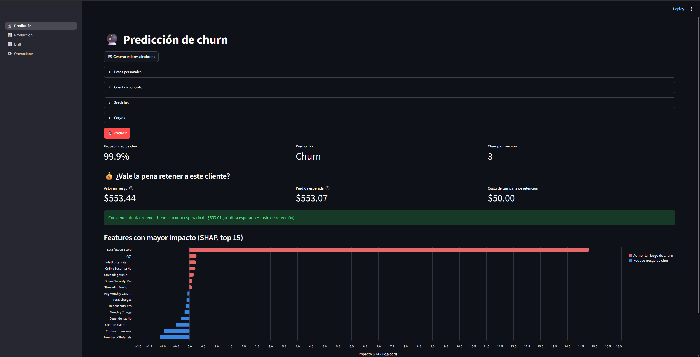
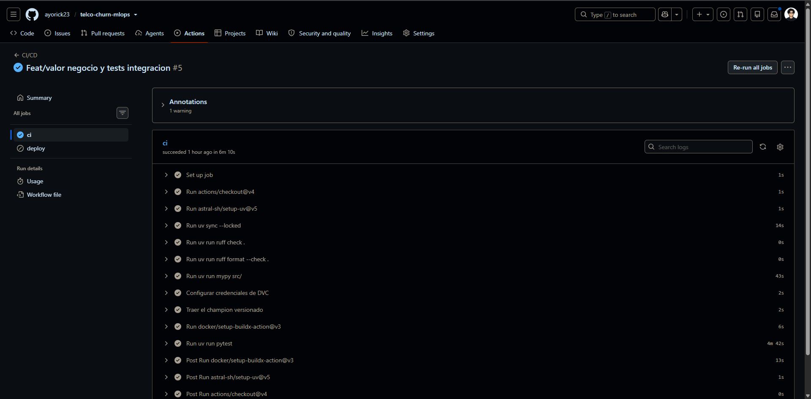

# Telco Churn MLOps — Caso de estudio

Sistema end-to-end de predicción de churn de clientes de telecomunicaciones
que va del EDA a producción: selección de modelo, tracking de experimentos,
monitoreo de drift, reentrenamiento con promoción champion/challenger,
serving con explicabilidad, y un cálculo de valor de negocio para priorizar
retención.

**Repositorio:** [github.com/ayorick23/telco-churn-mlops](https://github.com/ayorick23/telco-churn-mlops)

## De un vistazo

| Métrica             | Valor |
| ------------------- | ----- |
| ROC-AUC (champion)  | 0.99  |
| F1-Score (champion) | 0.93  |
| Recall — churn      | 91%   |
| Precisión           | 95%   |
| Clientes analizados | 7,043 |
| Tests automatizados | 149   |

---

## Contexto y problema de negocio

Retener un cliente existente cuesta significativamente menos que adquirir
uno nuevo, pero solo si la retención se dirige a los clientes correctos y
con margen suficiente para justificar el costo de la campaña. El proyecto
parte de un dataset real de telecomunicaciones (Telco Customer Churn, 7,043
clientes, 50 columnas: datos demográficos, contractuales, de servicios
contratados y facturación) con un objetivo doble:

1. Estimar la probabilidad de churn de cada cliente con suficiente confianza
   para priorizar intervención.
2. Sostener esa confianza en el tiempo, detectando cuándo el modelo se
   degrada frente a datos nuevos y decidiendo de forma objetiva cuándo
   reemplazarlo — no un modelo que se entrena una vez y se abandona.

## Enfoque de la solución

El sistema se diseñó como capas con dependencia en una sola dirección, cada
una desacoplada de la siguiente para que, por ejemplo, servir predicciones
nunca dependa de que el monitoreo esté arriba:

Cada decisión de arquitectura o tooling no obvia quedó documentada como ADR
**antes** de implementarse (14 ADRs a lo largo de 8 fases) — el objetivo
explícito del proyecto es demostrar el ciclo de vida completo de MLOps con
las mismas prácticas de un equipo real, no solo entregar un clasificador con
buena métrica.

## Datos: exploración y calidad

El EDA identificó, entre otros hallazgos, cuatro columnas con **data
leakage** (`Churn Score`, `Customer Status`, `Churn Category`, `Churn
Reason` — todas calculadas a partir del churn o solo disponibles después de
que ya ocurrió) y columnas de bajo valor de señal (`Latitude`, `Longitude`,
`Zip Code`, `CLTV`), documentadas y excluidas explícitamente en [ADR
0006](decisions/0006-exclusion-de-columnas-por-data-leakage.md).

El hallazgo de negocio más fuerte del EDA es cuantitativo, no anecdótico:

Un cliente sin compromiso contractual (`Month-to-Month`) tiene **18 veces**
más probabilidad de irse que uno con contrato de dos años — el tipo de señal
que después justifica, en la sección de impacto de negocio, por qué la
prioridad de retención no puede ser uniforme entre segmentos.

Antes de llegar al modelo, cada batch de datos pasa por un contrato de
schema con **Pandera** (tipos, nulabilidad, valores categóricos válidos)
verificado con tests automatizados — el objetivo es que un problema de
calidad de datos falle ruidoso en el pipeline, no silenciosamente en una
predicción de producción.

## Ingeniería de variables

De las 50 columnas originales quedan 37 features crudas después de excluir
leakage, IDs y columnas de bajo valor, más 2 variables derivadas
(`is_new_customer`, `num_extra_services`) diseñadas a partir de los
hallazgos del EDA, no de forma arbitraria.

El encoding y el escalado viven deliberadamente en la capa de
**entrenamiento**, no en features — features produce datos limpios y
comprensibles para un humano; el training decide cómo codificarlos según lo
que cada familia de modelo necesita, una separación de responsabilidades
documentada en [ADR 0007](decisions/0007-encoding-y-scaling-en-training-no-en-features.md).

## Modelado y experimentación

Se compararon 4 familias de modelos bajo el mismo protocolo de evaluación —
Regresión Logística (baseline), XGBoost, LightGBM y CatBoost — con foco
explícito en cómo cada una maneja las categóricas de alta cardinalidad del
dataset ([ADR 0009](decisions/0009-comparacion-4-familias-y-encoding-por-framework.md)):

LightGBM ganó la comparación inicial; ese resultado se llevó a un pipeline
definitivo con tuning bayesiano de hiperparámetros vía **Optuna** (50
trials, Stratified K-Fold para no sobreajustar la selección al split), que
subió el F1 del champion final a **0.931** con **ROC-AUC de 0.992**.

## MLOps: tracking, versionado y registry

Cada experimento (parámetros, métricas, artefactos) queda registrado en
**MLflow**, con el Model Registry gestionando qué versión sirve en
producción vía **aliases** (`champion`), no el sistema de _stages_ ya
deprecado. El código se versiona con Git y los datos/modelos con **DVC**
contra un remoto en DagsHub — la combinación permite reproducir cualquier
resultado pasado sabiendo exactamente qué código, qué datos y qué
configuración lo generaron, sin depender de que un notebook local siga
intacto.

Cada fase queda como su propio experimento en MLflow — no un solo bucket de
runs mezclados, sino un historial navegable de cuándo y por qué se generó
cada versión.

El mismo tracking, visto desde la UI de DagsHub (el servidor real donde vive
MLflow para este proyecto) — permite comparar métricas de runs distintos
lado a lado directamente en la tabla, sin abrir cada uno por separado.

## Monitoreo, drift y reentrenamiento

El sistema simula la llegada de datos nuevos con perturbaciones de
intensidad creciente y los evalúa con **Evidently AI** para detectar drift
de forma cuantitativa (`dataset_drift_share`). Un umbral de reentrenamiento
(10%, calibrado contra los resultados reales del propio proyecto, no un
número arbitrario) decide si amerita reentrenar; el challenger resultante se
compara contra el champion actual con un criterio de negocio explícito — no
solo F1 agregado: debe ganar por un margen mínimo (1 punto) y no retroceder
en ningún segmento relevante (tipo de contrato, método de pago, tipo de
internet) más de una tolerancia definida.

Reentrenar y promover son pasos deliberadamente manuales, con un humano en
el loop, no un cron job automático ([ADR 0012](decisions/0012-reentrenamiento-y-promocion-fase-6.md)).

El reporte real de Evidently AI para el batch de mayor intensidad simulada:
12.8% de las columnas (5 de 39) muestran drift, por debajo del umbral de
detección de dataset completo (0.5) pero por encima del umbral de
reentrenamiento del proyecto (10%) — el caso exacto que dispara el flujo de
reentreno.

## Serving, explicabilidad e impacto de negocio

El modelo se sirve vía una API REST (**FastAPI**, validación de requests con
Pydantic) con dos endpoints de negocio: predicción y explicación por
**SHAP** (`TreeExplainer`, valores exactos para modelos de árboles, sin
necesitar un dataset de background).

Un dashboard interactivo en **Streamlit** consume esa API y agrega una capa
de valor de negocio: para cada predicción, estima cuánto ingreso queda en
riesgo si ese cliente específico hace churn (valor restante de su contrato
actual, calculado a partir del mismo hallazgo de la sección de Datos) y
compara ese número contra el costo de una campaña de retención para decidir,
con un criterio explícito, si vale la pena intervenir — la parte del
proyecto que conecta la predicción técnica con la decisión de negocio real.

## Testing y CI/CD

149 tests automatizados (unitarios, de validación de datos, y de
integración) corren en cada push y pull request contra `main` vía
**GitHub Actions**, junto con lint (Ruff), formato y type-checking (MyPy)
como gate obligatorio antes de mergear.

Los tests de integración van más allá de mockear dependencias externas:
ejercitan el pipeline de producción real (sin mocks) y levantan el stack
completo con Docker Compose para detectar en CI la clase de bug que un test
unitario, por diseño, no puede ver — un contenedor que construye pero no
arranca, o un artefacto que nunca llega a la imagen final.

Un run real del job `ci` (lint, formato, type-check, y la suite completa de
tests) pasando en verde — el paso `pytest` de 4m 42s incluye el `docker
compose up --build` real de los tests de integración, no solo los tests
unitarios rápidos.

## Despliegue e infraestructura

La API y el dashboard están empaquetados como imágenes Docker independientes
(multi-stage builds, con `uv` para instalar dependencias exactas vía
lockfile) y orquestables localmente con Docker Compose.

El destino final de hosting quedó deliberadamente abierto durante el
desarrollo: dos plataformas de free-tier (Render, luego Hugging Face Spaces)
cambiaron de política de precios entre que se diseñó el despliegue y que se
intentó ejecutar — una decisión de infraestructura real y su trade-off, no
una limitación técnica del proyecto ([ADR 0014](decisions/0014-testing-cicd-despliegue-fase-8.md)).

## Retos técnicos y cómo se resolvieron

Esta es la sección que más diferencia a este proyecto de "otro notebook de
clasificación" — tres problemas reales, no hipotéticos, cada uno con su
diagnóstico completo, no solo el fix:

**1. Un bug del artifact storage de MLflow en DagsHub.** Al promover el
primer challenger contra un servidor MLflow real, la descarga del artifact
`preprocessor` colgaba 4 minutos y fallaba. El diagnóstico descartó, en
orden, reintentos, cuota de storage, credenciales, e incompatibilidad de
versión de cliente (probado forzando `mlflow==2.19.0` en un entorno
aislado) — hasta aislar que el bug estaba específicamente en cómo DagsHub
lista/sirve artifacts vía la API REST de MLflow, no en que los archivos
faltaran. La solución no fue esperar un fix externo: se rediseñó para
depender menos de esa descarga, versionando el champion con **DVC** en vez
de traerlo del Registry en cada comparación.

**2. Una imagen Docker que construía sin error pero no arrancaba.**
LightGBM necesita `libgomp.so.1` (runtime de OpenMP) para importarse, no
solo para entrenar. La etapa final de un multi-stage build (Python
"limpio", sin las herramientas de compilación de la etapa builder) no lo
incluía — el build pasaba perfecto, pero el contenedor entraba en crash
loop al arrancar. Encontrado recién al levantar el stack real con Docker
Compose, exactamente la clase de bug que motivó agregar tests de
integración que corren el contenedor, no solo lo construyen.

**3. Dos plataformas de hosting gratuito cambiaron de política a mitad de
la implementación.** Render empezó a exigir tarjeta de crédito para
verificar su free tier; la migración a Hugging Face Spaces (Docker)
recién implementada se volvió a bloquear cuando Hugging Face también
empezó a cobrar el SDK Docker. Ninguna de las dos veces era un problema de
código — ambas quedaron documentadas como decisiones de infraestructura
reales, con las alternativas evaluadas, no ocultas como si el despliegue
hubiera sido trivial.

## Resultados y aprendizajes

El resultado no es solo un clasificador con ROC-AUC de 0.99 y F1 de 0.93
sobre el champion en producción — es un sistema donde cada componente (qué
datos entraron, qué modelo se entrenó con qué hiperparámetros, por qué se
promovió o no una versión nueva, qué tan confiable sigue siendo frente a
datos que cambian) es trazable y auditable.

El proyecto demuestra que la parte más difícil de un sistema de ML en
producción rara vez es el modelo: es todo lo que lo rodea — validación,
reproducibilidad, gobierno de versiones, monitoreo continuo, y la
traducción final de una probabilidad a una decisión de negocio con un costo
real.
